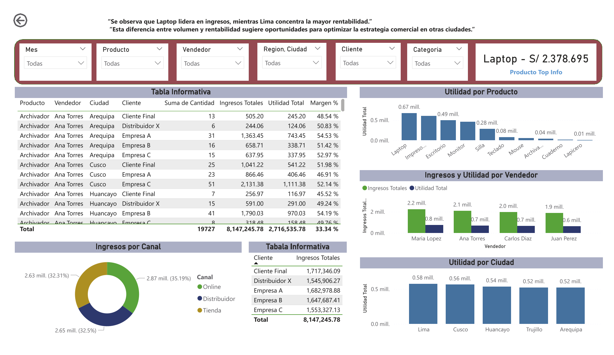

# 📊 SQL Sales Analysis Project

This project focuses on analyzing a real-world sales dataset using SQL to extract business insights and support decision-making.

---

## 🎯 Objective

Analyze sales performance to identify trends, profitability, and opportunities by category, region, and other key business dimensions.

---

## 📊 Dashboard Preview

### 📌 1. Resumen General

Includes:

* Revenue by month
* Top 5 products by revenue
* Revenue by channel
* Revenue by category
* Revenue by region


---

### 📌 2. Análisis de Rentabilidad

Includes:

* Profit by product
* Revenue and profit by salesperson
* Profit by city
* Revenue by channel



---

### 📌 3. Detalle de Ventas

Includes:

* Revenue by month
* Profit by city


---

## 🧱 Dataset

The dataset includes transactional sales data with the following key fields:

* Date (Fecha)
* Year (Año)
* Product & Category
* Customer & Location
* Sales Channel
* Quantity, Revenue, Cost, Profit

---

## 🧼 Data Cleaning

A SQL view (`ventas_limpias`) was created to:

* Fix encoding issues in column names (e.g., Año → Anio)
* Standardize category values (e.g., Tecnologia)
* Prepare data for analysis without modifying the original dataset

---

## 📊 Key Metrics

The following KPIs were calculated:

* **Total Revenue** → `SUM(Total)`
* **Total Profit** → `SUM(Utilidad)`
* **Total Quantity Sold** → `SUM(Cantidad)`
* **Profit Margin** → Profit / Revenue

---

## 📊 Analysis

### 📊 Sales by Category

* **Tecnologia** leads in revenue (~5.82M) with a total profit of ~1.87M and a margin of ~32%.
* **Muebles** shows balanced performance with ~2.2M in revenue and ~35% margin.
* **Oficina**, while generating lower revenue (~123K), has the highest margin (~58%), indicating strong profitability.

### 💡 Insight

Technology dominates in sales volume but has lower relative profitability. In contrast, Office products show high margins, suggesting an opportunity to increase revenue through growth strategies focused on high-profit items.

---

### 📅 Sales Trend Analysis

Sales performance was analyzed over time to identify patterns and seasonality.

#### 🔍 Results:

* February shows one of the highest revenue levels (~833K).
* Months like August present lower sales performance.
* Profit margin remains stable between ~32% and ~34%.

#### 💡 Insight:

Sales show seasonal variation across months. However, the consistent margin indicates stable cost management and pricing strategies over time.

---

### 🧑‍💼 Top Sales Performance

Se analizó el desempeño de los vendedores para identificar a los principales generadores de ingresos.

#### 🔍 Resultados:

* Maria Lopez lidera el ranking con aproximadamente **2.23M en ingresos** y **750K en utilidad**.
* Es seguida por Ana Torres (~2.08M) y Carlos Diaz (~1.95M).
* Todos los vendedores presentan márgenes similares (~33%).

#### 💡 Insight:

El rendimiento entre vendedores es consistente en términos de rentabilidad, lo que sugiere que la diferencia en desempeño está impulsada principalmente por el volumen de ventas y no por la eficiencia. Esto indica una oportunidad para replicar las estrategias comerciales del vendedor líder en el resto del equipo.

---

### 🌎 Sales by Region

Se analizó el desempeño de ventas por región para identificar diferencias en ingresos y rentabilidad.

#### 🔍 Resultados:

* **Sierra** lidera en ingresos con aproximadamente **2.83M**, seguida por **Selva** (~2.77M) y **Costa** (~2.53M).
* Sin embargo, **Costa presenta el mayor margen (~33.9%)**, superando a las demás regiones.

#### 💡 Insight:

Aunque la región Sierra genera el mayor volumen de ingresos, la región Costa destaca en rentabilidad. Esto sugiere oportunidades para optimizar precios o costos en Sierra o impulsar el crecimiento en Costa.

---

### 📈 Advanced Analysis: Region + Category

Se realizó un análisis cruzado entre región y categoría para identificar patrones de rendimiento más profundos.

#### 🔍 Resultados:

* La combinación **Sierra + Tecnologia** genera el mayor ingreso (~2.12M).
* La categoría **Tecnologia domina en todas las regiones**.
* La categoría **Oficina presenta el mayor margen (~58%–59%)** en todas las regiones.
* **Muebles** mantiene un desempeño intermedio.

#### 💡 Insight:

El negocio depende fuertemente de la categoría Tecnología para generar ingresos, pero esta no es la más rentable. En contraste, Oficina ofrece márgenes significativamente más altos.

Esto sugiere oportunidades para:

* Incrementar ventas de productos de alta rentabilidad
* Optimizar costos en Tecnología
* Balancear volumen vs rentabilidad

---

## 🧮 Example SQL Query

```sql
SELECT 
    Categoria,
    SUM(Total) AS Ingresos_Totales,
    SUM(Utilidad) AS Utilidad_Total,
    SUM(Cantidad) AS Cantidad_Total,
    SUM(Utilidad) * 1.0 / SUM(Total) AS Margen
FROM ventas_limpias
GROUP BY Categoria
ORDER BY Ingresos_Totales DESC;
```

---

## 🔗 Related Project

This SQL analysis complements the Power BI dashboard:

👉 https://github.com/YERHN28/netlive-dashboard-ventas-powerbi

---

## 🛠 Tools Used

* SQL (SQLite)
* Excel (Data exploration)
* Power BI (Visualization)

---

## 📌 Author

* Yerson Huaman Noriega
* Aspiring Data Analyst
